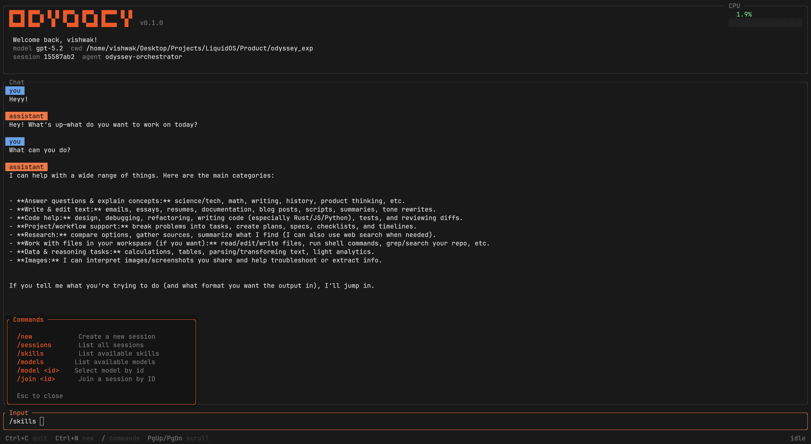

<div align="center">
  

# Odyssey 

**Agent Orcehstrator SDK in Rust with Batteries included**

[](https://github.com/liquidos-ai/Odyssey#license)

[Examples](examples/) | [Contributing](CONTRIBUTING.md)

</div>

---

> **Active Development:** This project is still in development, and not ready for production use yet, use it with caution.

Odyssey is a Rust-based Agent Orchestrator SDK that provides a core runtime, built-in tools, memory, sandboxing, and an integrated TUI for end-to-end agent workflows. With Odyssey, you can build desktop applications, robotics, and embedded systems with powerful agentic capabilities. It is built on top of our open-source agent framework [AutoAgents](https://github.com/liquidos-ai/AutoAgents).

***We’d love to see developers use Odyssey across diverse domains — experiment, build, and push open-source AI forward together.***

[](https://liquidos.ai)

### What's in this repo
- `crates/odyssey-rs-core`: Orchestrator runtime, permissions, sessions, prompt assembly.
- `crates/odyssey-rs-tools`: Tool registry and built-in tools.
- `crates/odyssey-rs-memory`: File-backed memory provider and policies.
- `crates/odyssey-rs-sandbox`: Sandbox policies and providers.
- `crates/odyssey-rs-protocol`: Event, request, and schema types.
- `crates/odyssey-rs`: SDK re-exports and helpers.
- `crates/odyssey-rs-tui`: Terminal UI client.
- `docs/`: mdBook documentation root (sources live in `docs/src`).

---

## Key Features

- **Native:** High-performance, embeddable orchestrator written in Rust (server mode coming soon).
- **Secure:** Secure by Deisgn and Pure Rust implementation.
- **Sandboxing:** Secure, sandboxed tool execution for agents (Linux supported currently).
- **Tool Permissions:** Built-in permission system and safety checks for tool usage.
- **Memory:** Pluggable and swappable memory layers.
- **Flexible:** Easily extend the orchestrator with custom agents, memory providers, and executors.
- **Local Model**: Support Local Models Embedded without external server using [AutoAgents](https://github.com/liquidos-ai/AutoAgents).

---

### Quickstart (SDK)
Set your OpenAI API key, then run the SDK example (or use your own binary):

```bash
export OPENAI_API_KEY="your-key"
cargo run -p odyssey-rs-hello-world
```

For a custom integration, see `docs/src/quickstart.md`.

### Run the TUI
```bash
export OPENAI_API_KEY="your-key"
cargo run -p odyssey-rs-tui
```

Optional flags:
```bash
cargo run -p odyssey-rs-tui -- --config ./docs/src/odyssey.json5 --model gpt-5.2
```

### Developement Setup

#### Prerequisites

- **Rust** (latest stable recommended)
- **Cargo** package manager
- **LeftHook** for Git hooks management
- **tokei** For lines of code

#### Install LeftHook

**macOS (using Homebrew):**

```bash
brew install lefthook
```

**Linux/Windows:**

```bash
# Using npm
npm install -g lefthook
```

#### Running Tests

```bash
# Run all tests --
cargo test --all-features

# Run tests with coverage (requires cargo-tarpaulin)
cargo install cargo-tarpaulin
cargo tarpaulin --engine llvm --skip-clean \
  --workspace \
  --exclude odyssey-rs-server \
  --exclude odyssey-rs-tui \
  --all-features \
  --out html
```

### Docs (mdBook)
```bash
mdbook serve docs
```

## License

Odyssey is licensed under:

- **Apache License 2.0** ([APACHE_LICENSE](APACHE_LICENSE))

---

## Community

- **GitHub Issues**: Bug reports and feature requests
- **Discussions**: Community Q&A and ideas
- **Discord**: Join our Discord Community using https://discord.gg/zfAF9MkEtK

---

## Acknowledgments

Built with ❤️ by the [Liquidos AI](https://liquidos.ai) team and our amazing community contributors.

Special thanks to:

- The Rust community for the excellent ecosystem
- OpenAI, Anthropic, and other LLM providers for their APIs
- All contributors who help make Odyssey better

---

<div align="center">
  <strong>Ready to build intelligent agents? Get started with Odyssey SDK today!</strong>

**Star us on GitHub** | 🐛 **Report Issues** | 💬 **Join Discussions**

</div>
