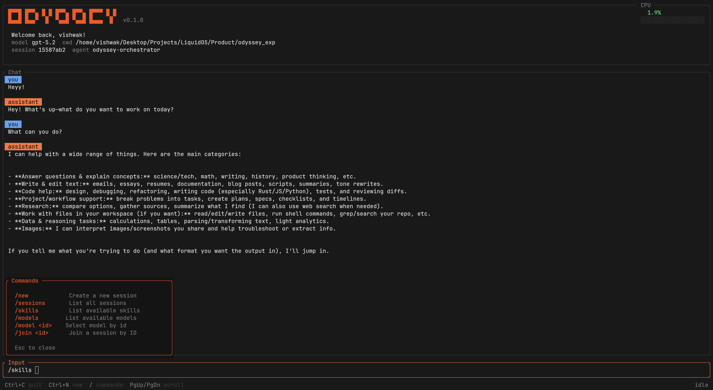

<div align="center">
  

# Odyssey 

**Programmatic Agent Orchestrator in Rust with Batteries Included**

[](https://liquidos-ai.github.io/Odyssey)
[](https://github.com/liquidos-ai/Odyssey/actions)
[](https://deepwiki.com/liquidos-ai/Odyssey)

[Documentation](https://liquidos-ai.github.io/Odyssey/) | [Examples](examples/) | [Contributing](CONTRIBUTING.md)

</div>

---

> **Active Development:** This project is still in development and is not ready for production use yet. Use it with caution.

Odyssey is a batteries-included, programmatic agent orchestrator written in Rust. It provides a core runtime, built-in tools, memory, permissions, and sandboxing out of the box. With Odyssey, you can build desktop applications, robotics, and embedded systems with powerful agentic capabilities. It is built on top of our open-source agent framework [AutoAgents](https://github.com/liquidos-ai/AutoAgents).

[](https://liquidos.ai)

### What's in this repo
- `crates/odyssey-rs-core`: Orchestrator runtime, permissions, sessions, prompt assembly.
- `crates/odyssey-rs-tools`: Tool registry and built-in tools.
- `crates/odyssey-rs-memory`: File-backed memory provider and policies.
- `crates/odyssey-rs-sandbox`: Sandbox policies and providers.
- `crates/odyssey-rs-protocol`: Event, request, and schema types.
- `crates/odyssey-rs`: High-level crate for embedding Odyssey programmatically.
- `crates/odyssey-rs-tui`: Terminal UI client.
- `docs/`: mdBook documentation root (sources live in `docs/src`).

---

## Key Features

- **Native:** High-performance, embeddable orchestrator written in Rust.
- **Batteries Included:** Runtime, tools, memory, permissions, and sandboxing are built in.
- **Secure:** Pure Rust implementation with permission gates and sandboxed tool execution.
- **Tool Permissions:** Built-in permission system and safety checks for tool usage.
- **Memory:** Pluggable and swappable memory layers.
- **Flexible:** Extend the orchestrator with custom agents, tools, memory providers, and executors.
- **Local Models:** Run embedded local models without an external server using [AutoAgents](https://github.com/liquidos-ai/AutoAgents).

---

### Quickstart
Set your OpenAI API key, then run the hello-world example or integrate Odyssey into your own Rust application:

```bash
export OPENAI_API_KEY="your-key"
cargo run -p odyssey-rs-hello-world
```

For a custom integration, see `docs/src/quickstart.md`.

### Run the TUI
```bash
export OPENAI_API_KEY="your-key"
cargo run -p odyssey-rs-tui
```

Optional flags:
```bash
cargo run -p odyssey-rs-tui -- --config ./docs/src/odyssey.json5 --model gpt-5.2
```

### Development Setup

#### Prerequisites

- **Rust** (latest stable recommended)
- **Cargo** package manager
- **Lefthook** for Git hooks management
- **tokei** for lines-of-code reporting

#### Install LeftHook

**macOS (using Homebrew):**

```bash
brew install lefthook
```

**Linux/Windows:**

```bash
# Using npm
npm install -g lefthook
```

#### Running Tests

```bash
# Run all tests --
cargo test --all-features

# Run tests with coverage (requires cargo-tarpaulin)
cargo install cargo-tarpaulin
cargo tarpaulin --engine llvm --skip-clean \
  --workspace \
  --exclude odyssey-rs-server \
  --exclude odyssey-rs-tui \
  --all-features \
  --out html
```

### Docs (mdBook)
```bash
mdbook serve docs
```

## License

Odyssey is licensed under:

- **Apache License 2.0** ([APACHE_LICENSE](APACHE_LICENSE))

---
